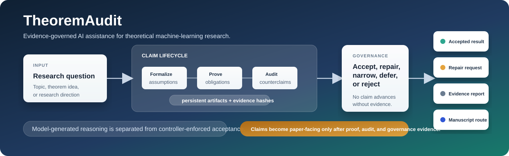
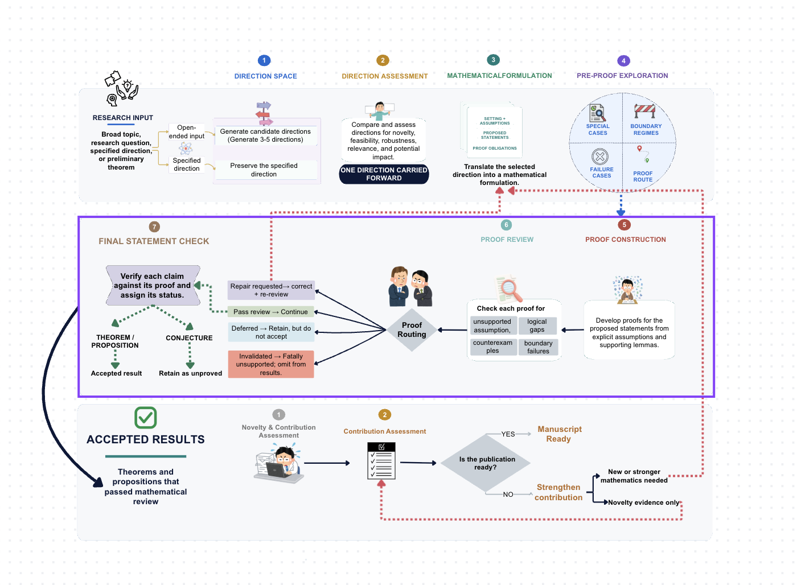

<p align="center">
  
</p>

<h1 align="center">TheoremAudit</h1>

<h2
<p align="center">
  <strong>A self-proving and self-verifying system<br>
  for automated theoretical machine learning paper generation</strong>
</p>
</h2>

<p align="center">
  <a href="https://help.openai.com/en/articles/20001256-plugins-in-codex"></a>
  
  <a href="#web-interface"></a>
  <a href="#research-skills"></a>
</p>

<p align="center">
  <a href="#quick-start"><strong>Quick Start</strong></a> &nbsp;&middot;&nbsp;
  <a href="#web-interface"><strong>Web Interface</strong></a> &nbsp;&middot;&nbsp;
  <a href="#demonstration"><strong>Demonstration</strong></a> &nbsp;&middot;&nbsp;
  <a href="docs/walkthrough.md"><strong>User Guide</strong></a> &nbsp;&middot;&nbsp;
  <a href="docs/architecture.md"><strong>Architecture</strong></a>
</p>

TheoremAudit is a Codex plugin that develops candidate theorems and proofs, reviews their
assumptions and arguments, and connects accepted results to a manuscript. Researchers can inspect
how a claim changed, which proofs support it, and what the paper is permitted to state.

<!-- <p align="center">
  
</p> -->

> [!NOTE]
> **Self-proving** means agent-driven proof construction. **Self-verifying** means adversarial
> review that searches for missing assumptions, invalid arguments, and counterexamples, not formal
> proof-assistant certification. Mathematical acceptance, contribution assessment, and submission
> readiness are separate decisions.

<details>
<summary><strong>Version and installation name</strong></summary>

Current manifest: `0.11.0+codex.20260922181856`.

Previously named **TheoremGate**. Installation identifiers, commands, and the
`.theoremgate/` storage directory retain that name for compatibility. Use **TheoremAudit** in
research prompts; the canonical repository is `VILA-Lab/TheoremAudit`.

</details>

## Table of Contents

<table>
  <thead>
    <tr>
      <th align="left" width="33%">🚀 Get Started</th>
      <th align="left" width="34%">🧠 Understand the System</th>
      <th align="left" width="33%">🔎 Run and Inspect</th>
    </tr>
  </thead>
  <tbody>
    <tr>
      <td valign="top">
        <a href="#start-here">🌟 Start Here</a><br>
        <a href="#demonstration">🎥 Demonstration</a><br>
        <a href="#selected-generated-papers">📄 Selected Generated Papers</a><br>
        <a href="#quick-start">🚀 Quick Start</a><br>
        <a href="#inputs-and-outputs">📦 Inputs and Outputs</a><br>
        <a href="#updating-the-plugin">🔄 Updating the Plugin</a>
      </td>
      <td valign="top">
        <a href="#capabilities">🌟 Capabilities</a><br>
        <a href="#how-it-works">🏗️ Architecture at a Glance</a><br>
        <a href="#research-skills">🧩 Research Skills</a><br>
        <a href="#results-and-revisions">💾 Results and Revisions</a><br>
      </td>
      <td valign="top">
        <a href="#using-theoremaudit">🔄 Using TheoremAudit</a><br>
        <a href="docs/walkthrough.md">📖 User Guide</a><br>
        <a href="#documentation">📘 Documentation</a><br>
        <a href="#citation">🔖 Citation</a>
      </td>
    </tr>
  </tbody>
</table>

## Start Here

Choose the route that matches what you want to do:

| Choose a route | Best for |
|:---|:---|
| 🚀 **[Quick Start](#quick-start)** | Installing the plugin and beginning a new research run. |
| 🖥️ **[Web Interface](#web-interface)** | Starting, resuming, or inspecting a run in the browser. |
| 📄 **[Selected Generated Papers](#selected-generated-papers)** | Reading example manuscripts produced by TheoremAudit. |
| ⌨️ **[Terminal](#terminal)** | Starting or resuming a run with explicit commands. |
| 📖 **[User Guide](docs/walkthrough.md)** | Starting, inspecting, and revising a research run. |
| 🔎 **[How It Works](#how-it-works)** | Understand the proof and review process. |
| 🧩 **[Architecture](docs/architecture.md)** | Explore the 16 skills, tools, and evidence structure. |
| 🔄 **[Updating the Plugin](#updating-the-plugin)** | Refresh an existing installation. |

## Demonstration

https://github.com/user-attachments/assets/7836998d-5b3b-4583-b148-9794fd25c388

The screencast shows the local web interface, research progress, claim review, evidence
inspection, and manuscript traceability.

## Selected Generated Papers

Explore how a research request develops into a manuscript with theoretical results, supporting
proofs, and numerical studies. The requests below reproduce the saved inputs for each run.
These are generated research drafts, not peer-reviewed publications; the system's review does
not independently certify correctness or novelty. Some PDFs retain review-template labels,
which do not establish actual submission or peer-review status.

| Research request | Generated paper | Read |
|:---|:---|:---|
| Develop and write a full theoretical research paper on compression of text representations. | **Corpus-Adaptive Pivotal Rounding for Pooled Text Representations** | [PDF · 21 pages](docs/generated-papers/text-representation-compression.pdf) |
| Develop and write a full theoretical research paper on learning under fairness constraints. | **Uniform Population Fairness: Common Kernels and Finite-Sample Utility** | [PDF · 24 pages](docs/generated-papers/population-fairness.pdf) |
| Use TheoremAudit to write a full theoretical research paper on uncertainty quantification in classification. | **Coverage Certificates under Nonidentifiable Label Shift** | [PDF · 15 pages](docs/generated-papers/label-shift-coverage.pdf) |
| Use TheoremAudit to write a full theoretical research paper on optimization for regularized learning | **Second-Order Support Certification for Inexact Regularized Optimization** | [PDF · 14 pages](docs/generated-papers/regularized-optimization.pdf) |
| Use TheoremAudit to write a full theoretical research paper on uncertainty quantification for text classification. | **Prediction Sets under Heterogeneous Annotation Noise: Exact Efficiency Limits for Binary Text Strata** | [PDF · 20 pages](docs/generated-papers/annotation-noise-prediction-sets.pdf) |
| Develop and write a full theoretical research paper on federated learning with heterogeneous data. | **Signed Local-Response Extrapolation for Heterogeneous Quadratic Federated Optimization** | [PDF · 21 pages](docs/generated-papers/federated-optimization.pdf) |

## Capabilities

TheoremAudit is designed for researchers developing theoretical machine learning results and for
developers studying evidence-based research agents. It addresses a problem that manuscript
generation alone does not solve: changes to an assumption or proof must also change the claims
that depend on it and the conclusions presented in a paper.

| Capability | What it provides |
|:---|:---|
| 🧭 **Research formulation** | Compare directions for a broad topic, preserve a specified direction, and define assumptions and proposed results. |
| 🔎 **Proof construction and review** | Develop supporting arguments, track dependencies, and search for missing assumptions, counterexamples, and unsupported conclusions. |
| 🔄 **Correction and strengthening** | Revise defective arguments or extend a limited contribution, then repeat review while retaining earlier work. |
| 📚 **Literature and contribution** | Retrieve primary sources, compare assumptions and conclusions, and assess novelty separately from mathematical support. |
| 🧪 **Empirical validation** | Design claim-linked experiments, inspect scripts, run bounded CPU studies, and retain results and their provenance. |
| 📝 **Manuscript preparation** | Plan, write, compile, and review a paper using the results permitted by the research assessment. |
| 🖥️ **Interactive inspection** | Follow a result through its assumptions, proofs, review findings, revisions, and manuscript sections. |

The system combines model-based research with software checks. The model constructs and reviews
arguments; tools check required evidence, file integrity, proof dependencies, and permitted stage
transitions. Neither a completed proof draft nor a compiled PDF alone establishes correctness.

## Inputs and Outputs

A run can begin with a broad topic, a specific question, a research direction, or a preliminary
conjecture. Optional constraints can state the mathematical setting, allowed methods, available
data, computing limits, or intended paper format. A proposed conjecture is a target to investigate,
not a conclusion the system must confirm.

| Mode or outcome | What you receive |
|---|---|
| **Theory-only run** | Reviewed statements, assumptions, supporting proofs, review findings, literature comparisons, and contribution assessments. |
| **Full research-to-paper run** | The research evidence plus manuscript sources, a PDF when compilation succeeds, and the manuscript review and revision history. |
| **No accepted mathematical result** | An evidence report describing the attempted direction, findings, limitations, and unresolved questions. |
| **Interrupted or unfinished run** | Saved progress that can be inspected and resumed using its run identifier. |

Outputs become available as their stages complete. For their locations and the meaning of result
statuses, see [Results and Revisions](#results-and-revisions).

## Quick Start

### Requirements

- An installed and authenticated [Codex CLI](https://help.openai.com/en/articles/11096431)
  with [plugin support](https://help.openai.com/en/articles/20001256-plugins-in-codex).
- Python 3.10 or newer and a writable research workspace.
- Network access for online literature retrieval.
- `pdflatex` and `bibtex` when compiling manuscript PDFs.

The plugin uses the active Codex model and does not require a separate model API key.
Reviewing a saved run does not start a new research job.

### Install

```bash
codex plugin marketplace add VILA-Lab/TheoremAudit --ref main
codex plugin add theoremgate@theoremgate
codex plugin list --json
```

Open a new Codex task after installation so the plugin's skills and tools are loaded.
In your research workspace, ask:

```text
Use TheoremAudit to develop and write a full theoretical research paper
on optimization for regularized learning.
```

A full run includes research development, review, contribution assessment, and manuscript
preparation. It may take time because the required stages depend on the question and revision
rounds. To stop after reviewed research results, request a **theory-only run**.

There are three distinct ways to use the repository:

- **Normal Codex use:** install the plugin from the GitHub marketplace and work through Codex.
  A repository clone is not required for research prompts.
- **Web or terminal access:** clone the repository when you want to launch the local interface,
  inspect saved runs, or start a run with explicit terminal commands.

## Using TheoremAudit

Codex, the local web interface, and the terminal use the same research history when pointed
at the same workspace and run. Use an explicit run identifier when continuing or revising work.

### Codex

```text
Use TheoremAudit to start a theory-only run for <research question>.

Use TheoremAudit to continue run <RUN_ID>.

Use TheoremAudit to inspect run <RUN_ID> and explain its unresolved proof issues.

Use TheoremAudit to revise the literature comparison for run <RUN_ID>.

Open the TheoremAudit web interface for this workspace.
```

The system handles routine stage transitions and bounded correction rounds within the requested
scope. It may narrow a claim or return an evidence report, but should not silently replace a
specified research direction.

### Web Interface

For the local web or terminal tools, clone the repository:

```bash
git clone https://github.com/VILA-Lab/TheoremAudit.git theoremgate
cd theoremgate
```

Start the local interface:

```bash
python3 ./plugins/theoremgate/scripts/theoremgate.py \
  --dashboard --workspace . --port 8765
```

Open [http://127.0.0.1:8765/](http://127.0.0.1:8765/). Replace `--workspace .` with your
research workspace path to inspect runs stored elsewhere. If the port is occupied, choose
another, such as `--port 8766`. Add `--no-open` to avoid opening a browser automatically.

The interface opens on **New research**, without loading a previous manuscript. Select a saved
run from the list to inspect it, or open a direct link such as
`http://127.0.0.1:8765/?run=RUN_ID`. Returning to **New research** clears the selected run's
paper and activity while preserving your entered question and constraints.

| View | What you can inspect |
|---|---|
| 🧭 **Research** | Start a full run from a question and optional constraints, monitor Codex activity, and resume saved work. |
| 📋 **Stages** | Research and manuscript progress, correction rounds, and linked revisions. |
| 🔎 **Issues** | Mathematical objections, proof-related evidence problems, and manuscript findings. |
| 🔗 **Evidence** | Results and a searchable graph connecting assumptions, proofs, reviews, and manuscript sections. |
| 📝 **Paper** | The compiled manuscript and its links to reviewed claims. |

The evidence workspace supports an expanded fullscreen view. Selecting a claim exposes its
supporting evidence; contextual actions prepare revision requests for execution through Codex.
Opening or refreshing the interface alone does not start a model run.

In **Evidence**, switch between **Results overview** and **Advanced graph**. The graph's **Core**
filter focuses on the main claim relationships, **Stress test** exposes review-related evidence,
and **Paper trace** follows links into the manuscript. **All** shows the full set of object types.
Search and object selection help narrow the view without changing the research evidence.

The **Stop** control ends a web-launched Codex job while preserving completed evidence. Only one
mutating Codex job runs per workspace. Activity launched elsewhere may appear through saved stages
and evidence without a corresponding live console session in this browser.

To share a read-only snapshot of a specific run:

```bash
python3 ./plugins/theoremgate/scripts/dashboard.py \
  --workspace . --run RUN_ID build
```

The export is written to `.theoremgate/dashboard/index.html`. It is self-contained and has
no run-execution controls.

### Terminal

From the cloned repository, start a full run:

```bash
python3 ./plugins/theoremgate/scripts/theoremgate.py \
  --terminal --workspace . \
  --log-file .theoremgate/logs/terminal-run.txt \
  start --question "Your theoretical ML research question"
```

Add `--mode theory` after `start` for a theory-only run, or
`--constraints "Your research constraints"` to specify scope. The optional log file receives
the terminal output by appending; relative log paths are resolved inside the workspace.

Resume an existing run without starting over:

```bash
python3 ./plugins/theoremgate/scripts/theoremgate.py \
  --terminal --workspace . resume --run RUN_ID
```

If automatic continuation stops before the workflow is complete, progress remains saved. Resume
the same run identifier to continue; this outcome alone does not indicate a mathematical failure.

## Updating the Plugin

For an installation from the GitHub marketplace:

```bash
codex plugin marketplace upgrade theoremgate
codex plugin add theoremgate@theoremgate
codex plugin list --json
```

Open a new Codex task to load the updated plugin. If you also launch the web interface from a
local clone, update that checkout separately with `git pull --ff-only` after committing or
safely setting aside local edits. The installed plugin and a local clone are separate copies.

## How It Works

The workflow connects five stages of research:

1. **Formulate the question.** Compare directions for a broad topic, or preserve a specified
   direction. Define assumptions, proposed theorems, and the arguments needed to establish them.
2. **Develop and review proofs.** Construct proofs and challenge their assumptions, derivations,
   dependencies, and scope. Correct or narrow defective claims, then repeat review.
3. **Assess the contribution.** Compare accepted results with prior work and assess their
   significance. Where needed, strengthen the results within a bounded revision process.
4. **Prepare the manuscript.** Write from the reviewed results, verify citations, run appropriate
   experiments, compile the paper, and review its claims and presentation.
5. **Inspect the outcome.** Trace each result through its assumptions, proof, review findings,
   revisions, and manuscript use.

<!-- <p align="center">
  
</p> -->

A theory-only run stops at a **theory bundle**: reviewed results, supporting evidence, contribution
assessments, and restrictions on manuscript use. Full runs continue to writing and review.

Not every run yields an accepted theorem. Narrowed claims, unresolved conjectures, rejected
statements, and evidence reports are valid outcomes. Producing a PDF does not by itself establish
originality or submission readiness.

## Research Skills

The plugin packages **16 skills** as reusable instructions for Codex, not 16 separate models.
The workflow selects the relevant responsibilities as research progresses; users do not need
to invoke each skill manually. Links below open the installed instructions.

| Research responsibility | Included skills |
|:---|:---|
| 🧭 **Direction and formulation** · 2 skills<br>Select or preserve a direction; specify assumptions, theorem targets, and required arguments. | [Research direction](plugins/theoremgate/skills/research-direction/SKILL.md)<br>[Theory discovery](plugins/theoremgate/skills/theory-discovery/SKILL.md) |
| 🔎 **Proof development and review** · 3 skills<br>Construct proofs, challenge their validity and scope, and correct defects. | [Proof development](plugins/theoremgate/skills/proof-development/SKILL.md)<br>[Adversarial audit](plugins/theoremgate/skills/adversarial-audit/SKILL.md)<br>[Proof repair](plugins/theoremgate/skills/proof-repair/SKILL.md) |
| 📚 **Literature and contribution** · 4 skills<br>Compare prior work, assess significance, and develop a contribution supported by reviewed results. | [Literature audit](plugins/theoremgate/skills/literature-audit/SKILL.md)<br>[Significance audit](plugins/theoremgate/skills/significance-audit/SKILL.md)<br>[Contribution development](plugins/theoremgate/skills/contribution-development/SKILL.md)<br>[Contribution strengthening](plugins/theoremgate/skills/contribution-strengthening/SKILL.md) |
| 🧪 **Empirical validation** · 1 skill<br>Plan and execute feasible experiments linked to accepted claims. | [Empirical validation](plugins/theoremgate/skills/empirical-validation/SKILL.md) |
| 📝 **Manuscript and venue** · 3 skills<br>Write, compile, review, and format the manuscript. | [Manuscript writing](plugins/theoremgate/skills/manuscript-writing/SKILL.md)<br>[Paper review](plugins/theoremgate/skills/paper-review/SKILL.md)<br>[Venue formatting](plugins/theoremgate/skills/venue-formatting/SKILL.md) |
| 🧩 **Run management and inspection** · 3 skills<br>Coordinate runs, route revision requests, and expose progress and supporting evidence. | [TheoremAudit coordinator](plugins/theoremgate/skills/theoremgate/SKILL.md)<br>[Research revision](plugins/theoremgate/skills/research-revision/SKILL.md)<br>[Dashboard](plugins/theoremgate/skills/dashboard/SKILL.md) |

For the executable tools that support these skills, see the
[tool inventory](docs/architecture.md#executable-tools-and-controllers).

## Results and Revisions

### Find the Outputs

Research is saved under `.theoremgate/runs/RUN_ID/` in the selected workspace. Files are created
as the corresponding stages complete, so an unfinished or theory-only run will not contain every
manuscript file below.

| Location inside a run | Contents |
|---|---|
| `run.json` | Research question, current stage, and completion history |
| `artifacts/` | Directions, assumptions, proposed results, review findings, and decisions |
| `proofs/` | Supporting arguments and their dependency index |
| `literature/` | Source registry and retrieved literature evidence |
| `artifacts/theory_bundle.json` | Reviewed research results, contribution assessments, and manuscript-use restrictions |
| `paper/paper.tex`<br>`paper/paper.pdf` | Assembled manuscript source and compiled PDF, when available |
| `paper/review.json` | Manuscript review findings and recommendation |
| `corrections/`<br>`strengthening/` | Earlier work preserved during correction or contribution-development rounds |

The terminal launcher prints the `run_id` when work starts. Keep that identifier when resuming or
requesting revisions. Do not edit completed evidence files directly; use the revision workflow.

### Interpret Decisions

| Decision | What it means |
|---|---|
| **Mathematical acceptance** | The result passed the system's proof review under its stated assumptions and scope. This is not formal proof verification. |
| **Novelty assessment** | The literature comparison assesses whether the result contributes something new. Insufficient evidence leaves novelty unresolved, rather than proving that the result is already known. |
| **Permission to write** | The reviewed results can be used within specified limits on the manuscript's claims. |
| **Submission readiness** | Remaining contribution, evidence, review, and formatting conditions have been assessed separately from merely producing a PDF. |

### Choose the Right Revision

- **Proof correction** addresses an identified defect in the assumptions, argument, or dependencies.
  The revised mathematics must undergo review again.
- **Contribution strengthening** adds or extends a result, or improves the literature comparison,
  when the existing contribution is insufficiently supported.
- **Manuscript revision** changes presentation, citations, experiments, or formatting without
  silently changing accepted mathematics. Mathematical changes after research completion require
  a linked research revision that preserves the earlier run.

These operations have different purposes. An unchanged theorem count can accompany a repaired
proof, and an added theorem can reflect contribution development rather than correction.

## Documentation

| Reference | Contents |
|---|---|
| 🧩 **[Architecture](docs/architecture.md#framework-at-a-glance)** | System layers and stage progression |
| 🧭 **[Research Skills](docs/architecture.md#reasoning-skills)** | Responsibilities of all 16 packaged skills |
| 🛠️ **[Executable Tools](docs/architecture.md#executable-tools-and-controllers)** | Proof, literature, experiment, manuscript, and interface tools |
| 🔎 **[Theory Workflow](docs/architecture.md#governed-theory-workflow)** | Stage names, assigned roles, and validation commands |
| 🔄 **[Correction and Revision](docs/architecture.md#repair-and-revision-semantics)** | Proof correction, contribution strengthening, and linked revisions |
| 📝 **[Manuscript Workflow](docs/architecture.md#manuscript-workflow)** | Writing, compilation, review, and final outputs |
| 📂 **[Run Directory](docs/architecture.md#run-directory)** | Saved evidence and file layout |
| 📖 **[User Guide](docs/walkthrough.md)** | Start, inspect, and revise a research run |

## Citation

```bibtex
@software{theoremaudit2026,
  title   = {TheoremAudit: A Self-Proving and Self-Verifying System for Automated Theoretical Machine Learning Paper Generation},
  author  = {{TheoremAudit Contributors}},
  year    = {2026},
  version = {0.11.0+codex.20260922181856},
  url     = {https://github.com/VILA-Lab/TheoremAudit}
}
```

---

<p align="center">
  <a href="#table-of-contents">↑ Back to contents</a>
</p>
